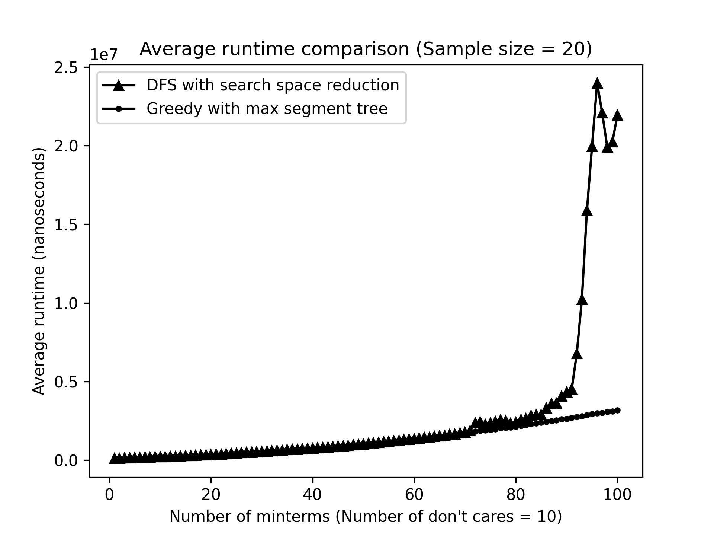
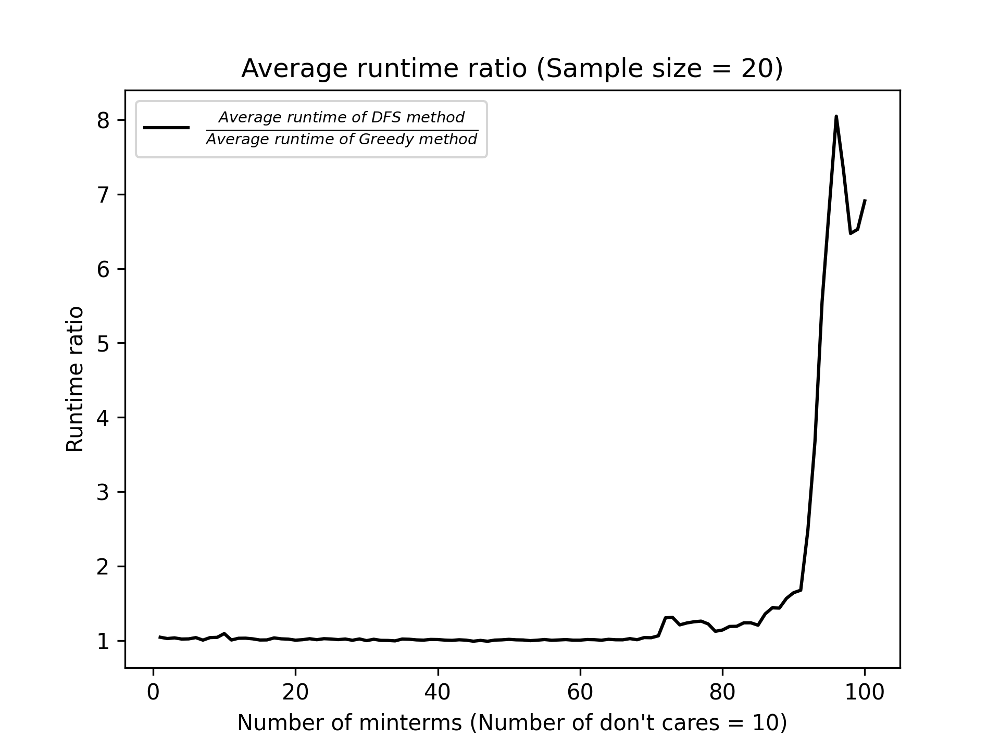
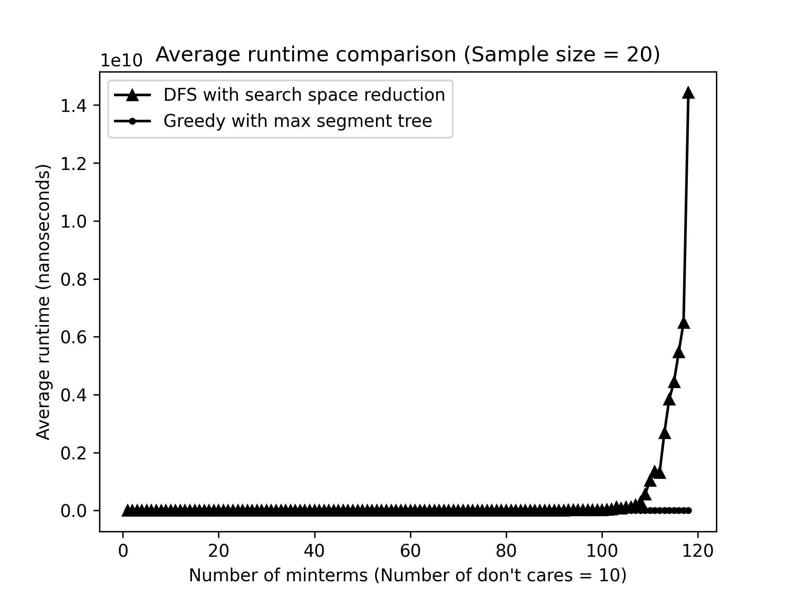
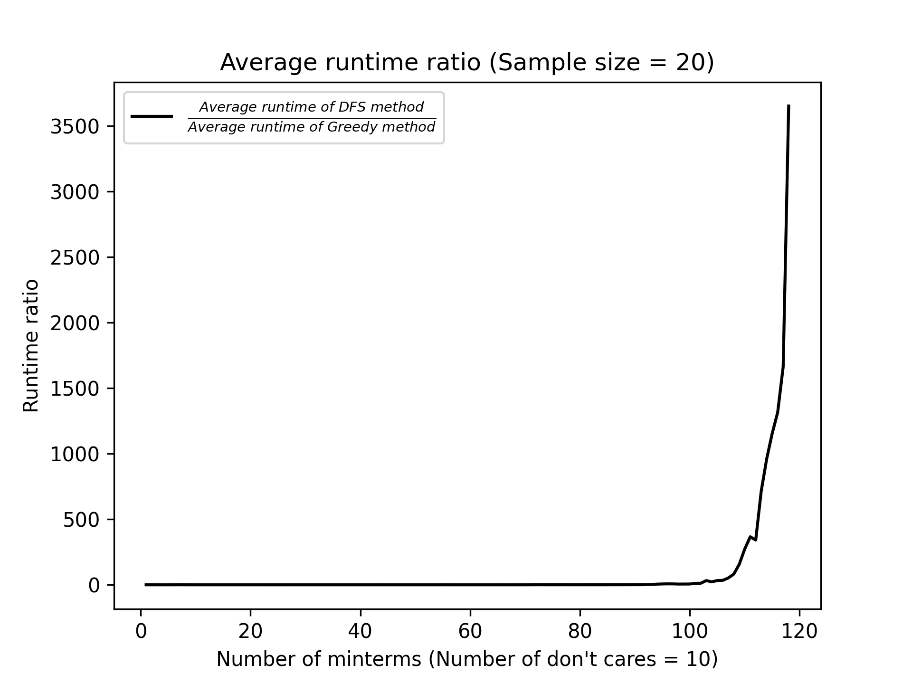
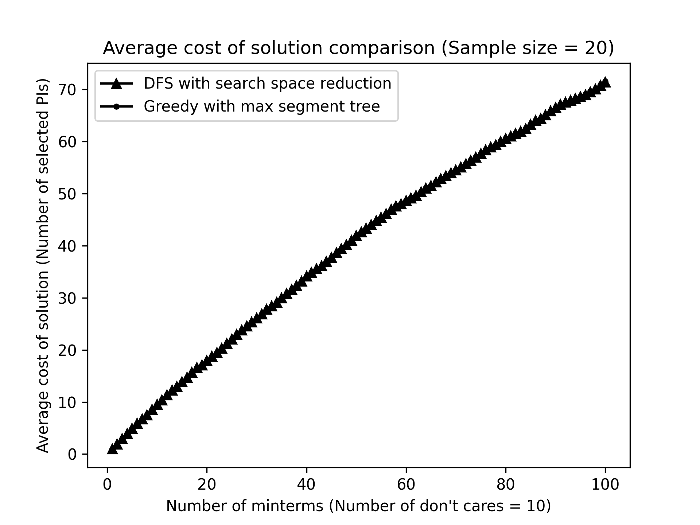
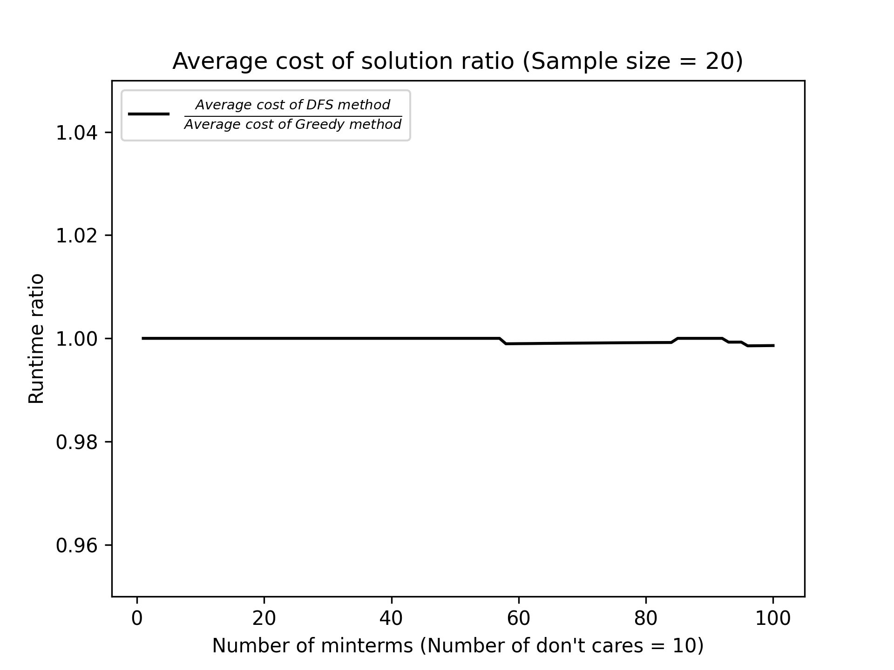
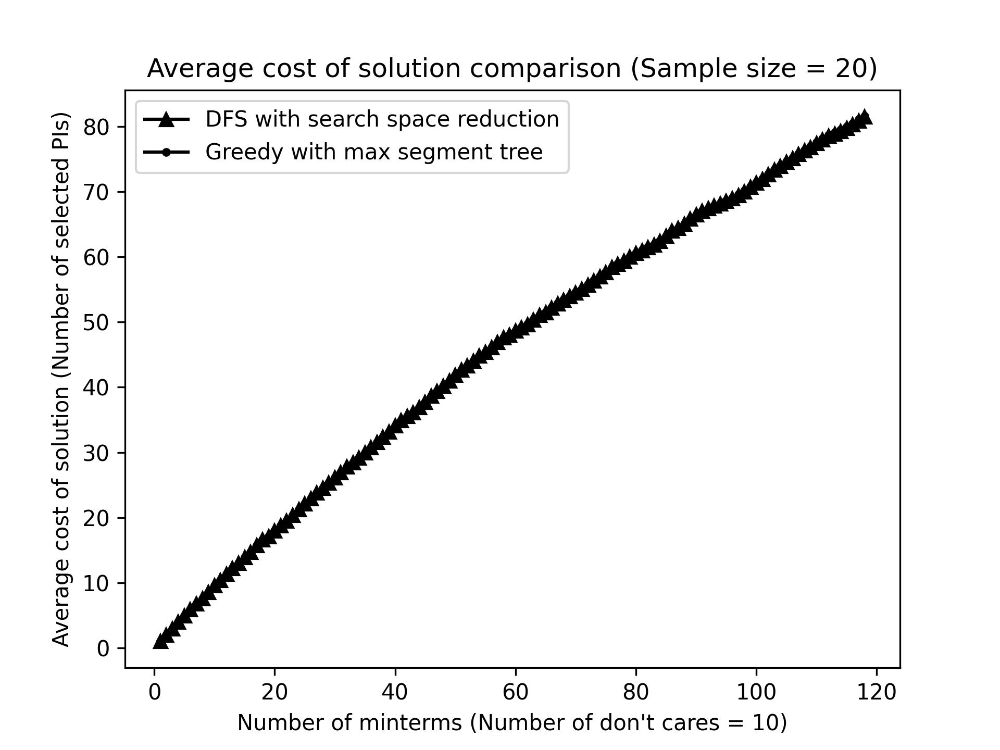

# Tabular-method-solver (Quine-McCluskey method)
Tabular method (Quine-McCluskey method) solver - 2020-01 Digital Logic Design 01

## 1. Author
* Name: 윤상건 (Sang-geon Yun)
* Student ID: 20191632

## 2. Version and Compile
* Version: C++14
* Compile command: `g++ -std=c++14 main.cpp -o main`

## 3. How to use
### 3.1. Run using `main.cpp`
You can run the `Tabular Method Solver` using main.cpp by editing data in `textCases.txt` file.

The format of `textCases.txt` is same as following:
```
(Number of test cases)
(Number of minterms of test case #1) (Minterms)
(Number of don't cares of test case #1) (Don't cares)
(Number of minterms of test case #2) (Minterms)
(Number of don't cares of test case #2) (Don't cares)
(Number of minterms of test case #3) (Minterms)
(Number of don't cares of test case #3) (Don't cares)
...
```

An example of `testCases.txt`:
```
5
5 0 1 5 6 7
0
5 0 1 2 3 7
0
8 0 2 5 6 7 8 9 13
3 1 12 15
8 0 4 8 10 11 12 13 15
0
10 0 2 3 4 6 7 9 11 13 15
0
```

### 3.2. Run using `TabularMethodSolver.h`
You can also run the `Tabular Method Solver` manually by using `TabularMethodSolver.h` header which supports a class for solving tabular method problem.

Checkout the following example:
```cpp
vector<unsigned long long int> minterms = {0, 2, 5, 6, 7, 8, 9, 13};
vector<unsigned long long int> dontcares = {1, 12, 15};
Tabular tabular(minterms, dontcares);
cout << "True solution: " << tabular.solve(false) << endl;
cout << "Approximation: " << tabular.solve(true) << endl;
```

If the number of minterms is too big to get true solution, you can get approximation solution which has polynomial time complexity by following.

* True solution: `tabular.solve(false)`
* Approximation solution: `tabular.solve(true)`

## 4. How it works

*Note: Every time complexities that written in this section are approximated. So they could be not accurate.*

### 4.1. Limitation

It only can get the solution for a situation where the number of variables is less or equal to 64 since it handle minterms by `unsigned long long int` type.

### 4.2. Algorithm

#### 4.2.1. Overal algorithm

Overal algorithm of Tabular Method Solver can described as following psudocode
```cpp
string solve(bool approx){
    getPI(); // Getting Prime Implicants
    getEPI(); // Getting Essential Prime Implicants
    vector<int> ans; // Stores PIs that cover every minterms in minimum cost
    if(approx) // Finding approximation solution using PIs that are not EPI.
        ans = approximationSolver();
    else // Finding true solution using PIs that are not EPI.
        ans = trueSolver();
    for(int i = 0, v = 0; i < PIs.size(); ++i)
        if(PIs[i].getEPI())
            ans.push_back(i); // Adding EPI to solution
    sort(ans.begin(), ans.end()); // For normalizing the solution
    string eq = ansToString(ans);  // Converting solution (PIs) to expression
    return eq; // Returing solution for input
}
```

#### 4.2.2. Algorithm for `getPI()`

The algorithm that is used for `getPI()` is same as the first step of Quine–McCluskey algorithm.

Time complexity can be calculated by following when `B` denotes the maximum number of bits of MST among the minterms and don't cares, `N` denotes the number of minterms, `M` denotes the number of don't cares, and `T_i` denotes the set of numbers with number of 1s in bits is equal to `i`.

* Time complexity: `O(B * sum(|T_i| * |T_(i+1)|))` = `O(B(N + M)^2)`

#### 4.2.3. Algorithm for `getEPI()`

When `getPI()` is executed, it's time to get all the EPI (Essential Prime Implicants) which are the PI that covers minterms that not be covered by any other PIs.

First of all, we need to uniform the coordinates. In this situation, the coordinate means value of minterms. For example, if given minterms are `{0, 2, 5, 6, 7, 8, 9, 13}` then we can convert them into this: `{0: 0, 2: 1, 5: 2, 6: 3, 7: 4, 8: 5, 9: 6, 13: 7}` so we can handle minterms much more easier.

This is called Coordinate Compression. And it cost `O((N + M)log(N + M))` time.

After that, we can define the following tables.
```
cnt[i] = Number of times when coordinate i was selected by different PIs
last[i] = Index of PI that selected coordinate i in last time
```
We can fill up those tables in `O((N + M)^2 log(N + M))` time.

Then, we can find every EPIs by following:
```cpp
for(int i = 0; i < minterms.size(); ++i){
    int compPos = comp[minterms[i]]; // Compressed coordinate
    if(cnt[compPos] == 1){ // cnt[i] == 1 means the number of PIs that selected coordinate i is one (It means, there are only one PI that covers i)
        if(PIs[last[compPos]].getEPI()) // Already EPI
            continue;
        PIs[last[compPos]].setEPI(); // EPI Found!
        ++totNumberOfEPI;
    }
}
```
And the time complexity of above procedure is `O((N + M)log(N + M))`

As a result the total time complexity of `getEPI()` is:
* Time complexity: `O((N + M)log(N + M) + (N + M)^2 log(N + M) + (N + M)log(N + M))` = `O((N + M)^2 log(N + M))`

#### 4.2.4. Algorithm for choosing minimum number of PIs to cover all the minterms

First of all, we know that EPIs are must be chosen since there are no other PIs that cover certain coordinates.

So, we can eliminate EPIs and coordinates that are chosen by those EPIs from the problem.

And then, we need to choose minimum number of PIs among the rest of the PIs.

This is where the problem gets really difficult.

Let say we got following PIs:
```
p1 = {0, 1}
p2 = {1, 2, 3}
p3 = {3, 4}
p4 = {0, 4}
```
And we have to cover `{0, 1, 2, 3, 4}` by choosing PIs that are listed in the above.

To make this problem easier to see, we can make the graph as following:


Now, the problem is converted to **Set Cover** Problem since we have to choose minimum number of vertices from `G_L` to flow from `G_L` to every vertices in `G_R`.

And as you know, Set Cover problem is **NP-complete** problem. So, it's impossible to find true solution in polynomial time.

So, I made two ways to solve this problem. By **Brute force Algorithm with reducing search space technique** and **Greedy Algorithm using max segment tree**.

#### 4.2.4.1. Algorithm for getting true solution: Brute force Algorithm with reducing search space technique

The code for this is same as following:
```cpp
void bruteForce(vector<vector<int>>& G, vector<int>& selected, vector<int>& nowCase, vector<int>& minCase , int selCnt, int idx, int cost, int& minCost){
    if(idx == G.size() || (minCost != -1 && minCost <= cost)) // Reducing search space using current minimum solution
        return;
    
    // search without choosing current vertex
    bruteForce(G, selected, nowCase, minCase, selCnt, idx + 1, cost, minCost);

    // search while choosing current vertex
    int cnt = 0;
    for(int i = 0; i < G[idx].size(); ++i){
        int u = G[idx][i];
        if(!selected[u]) ++cnt;
        ++selected[u];
    }
    nowCase.push_back(idx);
    if(cnt){ // Check if choosing current vertex made new selected vertex in G_R
        if(selCnt + cnt == selected.size()){ // If every vertices in G_R are selected
            if(minCost == -1 || minCost > cost + 1){ // Update minimum cost
                minCost = cost + 1;
                minCase.clear();
                for(int i = 0; i < nowCase.size(); ++i)
                    minCase.push_back(nowCase[i]);
            }
        }else{
            bruteForce(G, selected, nowCase, minCase, selCnt + cnt, idx + 1, cost + 1, minCost);
        }
    }
    for(int i = 0; i < G[idx].size(); ++i){
        int u = G[idx][i];
        --selected[u];
    }
    nowCase.pop_back();
}
```

It simply do the DFS(Depth First Search) for every possible case based on current minimum cost. So, it has exponential time complexity.

* Time complexity: `O(2^(N + M) + N + M)`

#### 4.2.4.2. Algorithm for getting approximation solution: Greedy Algorithm using max segment tree

As you saw in `4.2.4.1.` it is impossible to solve for true solution when the number of minterms gets higher than 27.

So, it is much more realistic to solve this **Set Cover** problem in polynomal time by getting approximation solution.

My idea on this approximation solution is like following psudocode:
```
Count := number of selected vertices in G_R
Flow[v] := number of unselected vertextes in G_R that vertex v from G_L is directing
while Count < |G_R|:
    v := argmax(Flow)
    Select v
    Add v to solution
    Update Flow[]
```

It is simple method but, getting value of `argmax(Flow)` and updating `Flow[]` consume a lot of time.

To make getting value of `argmax(Flow)` and updating `Flow[]` faster, I used **Max Segment Tree**.

Each node in segment tree constructed by following structure:
```cpp
struct segNode{
    int value, idx;
    segNode(){
        value = -1; idx = -1;
    }
    segNode(int value, int idx){
        this->value = value;
        this->idx = idx;
    }
    bool operator<(const segNode& another)const{
        return value < another.value;
    }
    bool operator>(const segNode& another)const{
        return value > another.value;
    }
    segNode operator+(const segNode& another)const{
        segNode ret;
        ret.value = value + another.value;
        ret.idx = idx;
        return ret;
    }
};
```

Each node has two values:
* `value`: number of unselected vertextes in G_R that vertex v from G_L is directing
* `idx`: index of vertex in `G_L`

Using this segment tree, we can perform getting value of `argmax(Flow)` in `O(log(N + M))` and updating `Flow[]` in `O(log(N + M))` (Amortized time complexity).

Checkout the following example:

* Getting `argmax(Flow)`


* Updating `Flow[]`


* Getting `argmax(Flow)`


Full greedy algorithm using segment tree written in C++ is same as following:
```cpp
void greedy(vector<vector<int>>& GL, vector<vector<int>>& GR, vector<int>& selected, vector<int>& minCase){
    int nL = GL.size(), nR = GR.size();
    MaxSegment<segNode> seg(nL);
    for(int v = 0; v < nL; ++v)
        seg.setValue(0, v, 0, nL - 1, segNode(GL[v].size(), v));

    int count = 0;
    while(count < selected.size()){
        segNode maxnode = seg.query(0, 0, nL - 1, 0, nL - 1);
        minCase.push_back(maxnode.idx);
        for(int i = 0; i < GL[maxnode.idx].size(); ++i){
            int u = GL[maxnode.idx][i];

            if(selected[u]) continue;
            selected[u] = true;
            ++count;
            for(int j = 0; j < GR[u].size(); ++j){
                int v = GR[u][j];

                seg.update(0, v, 0, nL - 1, segNode(-1, 0));
            }
        }
    }
}
```

* Time complexity: `O((N + M)log(N + M))` (Amotized time complexity)

### 4.2.5. Overal Approximate Time Complexity

The approximate time complexities of each method are:
* True Solution: `O(2^(N + M))`
* Approximation Solution: `O((N + M)^2 log(N + M))`

## 5. Accuracy of the algorithm

I tested accuracy of the algorithm using the following test cases:
```
5
5 0 1 5 6 7
0
5 0 1 2 3 7
0
8 0 2 5 6 7 8 9 13
3 1 12 15
8 0 4 8 10 11 12 13 15
0
10 0 2 3 4 6 7 9 11 13 15
0
```

And the result is this:
```
Minterms: 0, 1, 5, 6, 7, 
Dont cares: 
True solution: F = a'b' + ac + ab
Approximation: F = a'b' + ac + ab

Minterms: 0, 1, 2, 3, 7, 
Dont cares: 
True solution: F = bc + a'
Approximation: F = bc + a'

Minterms: 0, 2, 5, 6, 7, 8, 9, 13, 
Dont cares: 1, 12, 15, 
True solution: F = a'cd' + b'c' + bd
Approximation: F = a'cd' + b'c' + bd

Minterms: 0, 4, 8, 10, 11, 12, 13, 15, 
Dont cares: 
True solution: F = ab'c + abd + c'd'
Approximation: F = ab'c + abd + c'd'

Minterms: 0, 2, 3, 4, 6, 7, 9, 11, 13, 15, 
Dont cares: 
True solution: F = a'd' + cd + ad
Approximation: F = a'd' + cd + ad
```

## 6. Performance Test

In this section, we're going to check how well the algorithm works in two perspectives: **runtime**, and **cost of the solution**.

The main point is comparing results of two methods which are DFS with search space reduction, and greedy algorithm with max segment tree.

To measure indexes(Runtime, and cost of the solution) of algorithm, I setted the sample size as 20. It means that measures 20 (sample size) times for a single constraint(In this case, number of minterms) ​​and then stores arithmetic mean of those measured 20 values which is presenting measured value of index for a single constraint.

Input data was generated in uniformed random. And for uniformed input data, I made i<sup>th</sup> sample in each constraint uses i<sup>th</sup> random seed. It means that samples in the same order in each constraint will have a same random seed.

You can find the code that used in this tests in the `./test` directory.

### 6.1. Runtime test





You can notice that the runtime of DFS method increases in exponential scale while runtime of greedy method increases in polynomial scale. Especially in the last case (Number of minterms = 118) DFS method were 3651 times slower than Greedy method.

### 6.2. Cost of the solution test

Cost means the number of PIs that are selected to cover all the given minterms.





The ratio of average cost of solution almost equals to value of 1 even though the ratio of average runtime gets much much more larger.
